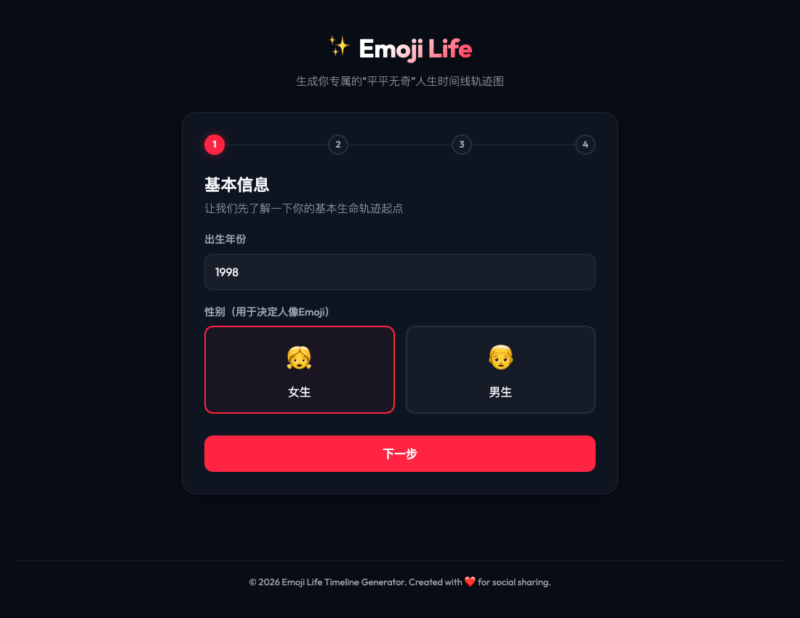
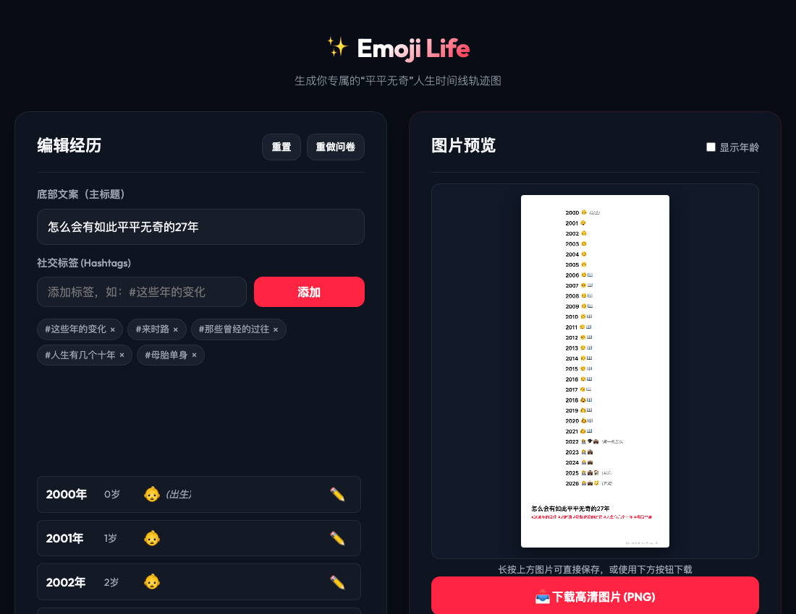
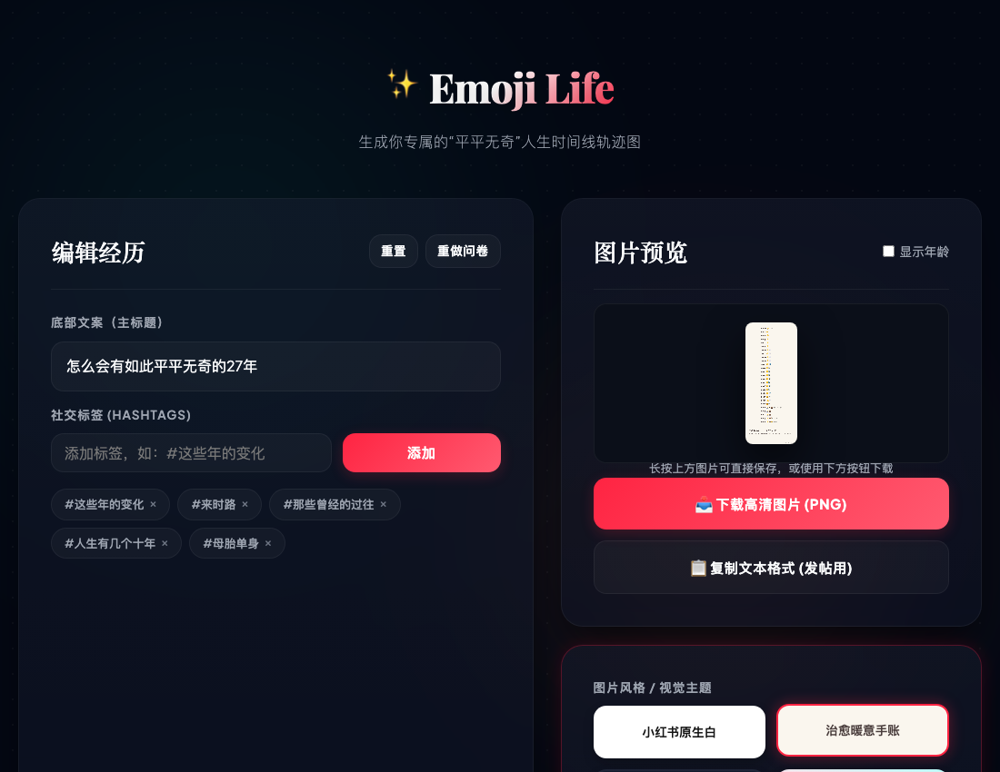
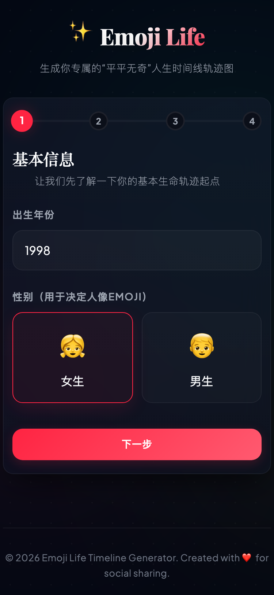
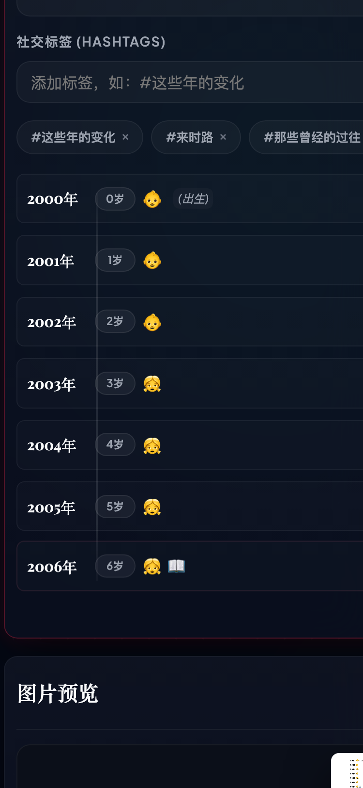
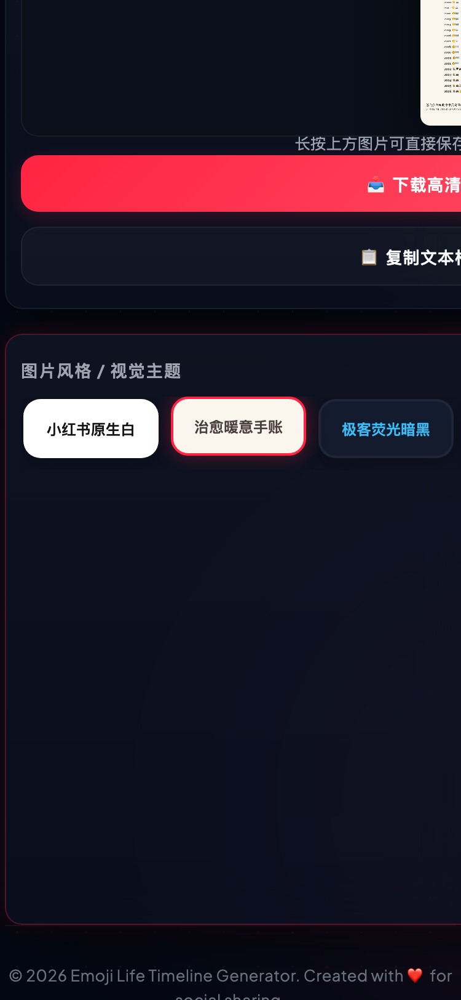

# Emoji Life - 专属人生时间线轨迹生成器 ✨

Emoji Life 是一个响应式、移动端优先的 Web 工具，帮助用户通过最简单的 **年份 + Emoji** 组合，快速生成极具社交分享感的人生回忆轨迹图（完美适配小红书、微信朋友圈、微博等平台）。

👉 **在线体验地址**: [https://holynova.github.io/life_emoji/](https://holynova.github.io/life_emoji/)

---

## 📸 应用截图与界面预览

### 💻 桌面端预览
````carousel

<!-- slide -->

<!-- slide -->

````

### 📱 移动端小屏适配预览
````carousel

<!-- slide -->

<!-- slide -->

````

---

## 🌟 核心功能特性

1. 📝 **趣味问卷引导 (Wizard)**
   - 拒绝“空白纸焦虑”，只需回答几个必经的人生节点（如出生年份、性别、毕业年份、参加工作年份），即可快速构建出 80% 的人生基本时间线骨架。
   
2. 🛠️ **高自由度微调 (Timeline Editor)**
   - 点击任意年份，即可单独编辑该年的事件。
   - 提供 15+ 种涵盖**学业、职场、资产、家庭、情感、爱好**的“所获物”单 Emoji 预设（如 🏠买房、🚗买车、💍结婚、🐱养猫）。
   - 允许添加自定义括号文字描述（如 `(牛马)` 或 `(精致穷)`），拉满趣味性。

3. 🎨 **多套精致视觉主题 (Themes)**
   - **小红书原生白**：极致还原经典发帖风格，低调真实。
   - **治愈暖意手账**：复古奶油底色配优雅衬线字体。
   - **极客荧光暗黑**：暗夜黑客的低保真代码风。
   - **多巴胺/落日渐变**：活力四射的社交分享渐变卡片。

4. 📥 **一键导出 PNG / 复制文本**
   - 采用 2x Retina 高清渲染的 Canvas 导出技术，保证图片在手机屏幕上依然清晰。
   - 支持一键复制文本格式，直接满足纯文本排版发帖的需求。
   - 支持勾选“显示年龄”，在年份旁自动计算并展示当时岁数。

---

## 🚀 本地开发与启动

请确保您已安装 [Node.js](https://nodejs.org/) (建议 v18+)。

```bash
# 1. 克隆并进入项目目录
cd emoji_life

# 2. 安装项目依赖
npm install

# 3. 启动本地开发服务
npm run dev
```
打开浏览器访问控制台输出的本地地址（通常是 `http://localhost:5173`）即可体验。

---

## 📦 打包与部署

### 选项 A：自动部署 (GitHub Actions) - 推荐
项目已内置 GitHub Actions 自动化工作流。只需将代码推送到 GitHub 的 `main` 核心分支，系统会自动进行构建并发布到 GitHub Pages。
> 配置文件见：[.github/workflows/deploy.yml](.github/workflows/deploy.yml)

### 选项 B：手动部署 (命令行)
若要从本地手动构建并推送至 `gh-pages` 分支：
```bash
# 执行部署命令（会自动运行 npm run build 并将 dist 文件夹发布）
npm run deploy
```
